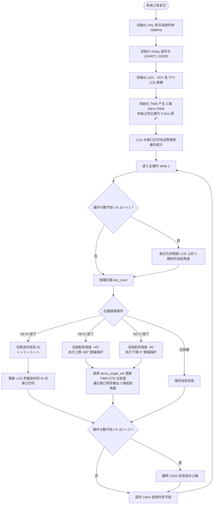

# STM32F407 舵机控制实验（Exp7_ServoMotor）项目总结文档

---

## 1. 工程概述

本项目为基于**正点原子 STM32F407IGT6 探索者开发板**实现的**三路模拟舵机控制系统**。
系统利用 STM32 内部的高级定时器（TIM8）产生三路独立的 50Hz（周期 20ms）PWM 脉宽调制信号，通过板载按键实现被控舵机通道切换以及转动角度在 0° ~ 180° 范围内的步进调节，并在 TFT-LCD 液晶屏和调试串口上实时显示当前选中通道与各舵机角度数据。

### 基本规格
- **主控芯片**：STM32F407IGT6（ARM Cortex-M4 内核，主频 168MHz，带硬件 FPU）
- **控制对象**：标准 180° 模拟舵机（支持 3 路独立控制）
- **信号标准**：标准 RC 舵机 PWM 控制信号（周期 20ms / 频率 50Hz，有效脉宽 0.5ms ~ 2.5ms）
- **交互方式**：按键输入控制 + TFT-LCD 实时显示 + USART1 串口数据回显

---

## 2. 舵机工作控制原理

### 2.1 舵机内部结构与闭环控制机制
模拟舵机（Servo Motor）是一种具有闭环位置反馈控制的位置伺服驱动器，其内部主要由以下部分构成：
1. **小型直流有刷电机**：提供驱动动力源；
2. **高传动比减速齿轮组**：降低电机转速并成倍放大输出轴扭矩；
3. **位置反馈电位计**：同轴连接在输出轴上，实时检测输出轴的物理角度并转换为模拟电压信号；
4. **内部控制电路板（误差放大器/比较驱动器）**：
   - 接收单片机输入的标准 PWM 控制信号，经积分/解调电路生成参考电压 $V_{\text{ref}}$；
   - 采集电位计的实际位置反馈电压 $V_{\text{fb}}$，对比产生误差电压 $\Delta V = V_{\text{ref}} - V_{\text{fb}}$；
   - 根据误差极性与大小驱动电机正向或反向旋转，直至输出轴角度到达设定值，误差归零并保持位置锁定。

### 2.2 PWM 信号参数与角度映射关系
标准模拟舵机采用周期为 **20ms（频率 50Hz）** 的脉冲信号进行角度定位：
- 高电平脉冲宽度范围为 **0.5ms ~ 2.5ms**，线性对应输出轴转动范围 **0° ~ 180°**；
- 角度与脉冲宽度呈线性对应关系：
  $$\text{脉宽 } t_{\text{pulse}} = 0.5\text{ms} + \frac{\text{Angle}}{180°} \times 2.0\text{ms}$$

| 控制角度 | 脉冲高电平宽度 | 占空比（周期 20ms） | 功能定义 |
| :---: | :---: | :---: | :---: |
| **0°** | 0.5 ms (500 µs) | 2.5% | 顺时针极限位置 |
| **45°** | 1.0 ms (1000 µs) | 5.0% | 步进档位 1 |
| **90°** | 1.5 ms (1500 µs) | 7.5% | **中立基准点（中位）** |
| **135°** | 2.0 ms (2000 µs) | 10.0% | 步进档位 2 |
| **180°** | 2.5 ms (2500 µs) | 12.5% | 逆时针极限位置 |

### 2.3 定时器计数参数与脉宽换算
在 `atim_timx_pwm_chy_init(20000 - 1, 168 - 1)` 中配置了高级定时器 TIM8：
1. **时钟分频与时钟源**：
   - STM32F407 的高级定时器 TIM8 挂载在 APB2 总线上。当 APB2 预分频系数为 2 时，根据时钟倍频机制，定时器内部时钟为 $168\text{ MHz}$。
   - 预分频器（PSC）设置为 $168 - 1$：
     $$f_{\text{cnt}} = \frac{168\text{ MHz}}{168} = 1\text{ MHz} \implies \text{每个计数脉冲周期为 } 1\ \mu\text{s}$$
2. **PWM 周期与自动重装载值（ARR）**：
   - 自动重载寄存器（ARR）设置为 $20000 - 1$：
     $$T_{\text{PWM}} = 20000 \times 1\ \mu\text{s} = 20000\ \mu\text{s} = 20\text{ ms}\ (50\text{ Hz})$$
3. **比较寄存器（CCR）数值直接对应脉冲宽度**：
   - 脉冲宽度单位为微秒（$\mu\text{s}$），因此 CCR 比较值即可直接换算为 $500 \sim 2500$ 的整数数值。

---

## 3. 硬件架构与引脚资源分配

### 3.1 核心引脚功能表

| 功能模块 | 引脚标识 | 复用/外设功能 | 硬件电平与功能说明 |
| :--- | :--- | :--- | :--- |
| **舵机通道 1** | `PI5` | TIM8_CH1 (PWM) | 输出 50Hz PWM 信号，控制 1 号舵机接口 |
| **舵机通道 2** | `PI6` | TIM8_CH2 (PWM) | 输出 50Hz PWM 信号，控制 2 号舵机接口 |
| **舵机通道 3** | `PI7` | TIM8_CH3 (PWM) | 输出 50Hz PWM 信号，控制 3 号舵机接口 |
| **按键 KEY0** | `PE2` | GPIO_Input (上拉) | 按下为低电平，循环切换当前调节的舵机 ID（1 → 2 → 3） |
| **按键 KEY1** | `PE3` | GPIO_Input (上拉) | 按下为低电平，增加当前舵机角度（+45°，最高 180°） |
| **按键 KEY2** | `PE4` | GPIO_Input (上拉) | 按下为低电平，减小当前舵机角度（-45°，最低 0°） |
| **运行状态灯 LED0** | `PE0` | GPIO_Output (推挽) | 低电平点亮，主循环计数约每 200ms 翻转一次作为系统心跳 |
| **调试串口 USART1** | `PA9` (TX) / `PA10` (RX) | USART1 复用 | 波特率 115200 8-N-1，输出日志与实时角度 |
| **TFT-LCD 屏幕** | FSMC 16位 8080 并口 | 外部存储控制器 | 实时显示当前舵机 ID、操作指南与三路实时角度 |

### 3.2 电源供电与跳线配置
1. **输入电源**：
   舵机为高瞬态电流电机设备，不能仅依靠 USB 端口供电。底板必须接入 **DC 12V 适配器**；
2. **跳线帽 JP3 配置**：
   - 必须通过跳线帽将 **`SRV+` 与 `VCC_SRV` 短接**，以便利用底板内置的 DC-DC 降压电路为舵机提供驱动电源；
   - 若使用外部专用电源为舵机供电，需将外部电源正极接入 `SRV+`，并保证外部电源与单片机系统**共地（GND）**；
3. **电平驱动电路**：
   STM32F407 输出的 3.3V 控制信号在板载底板上经过了电平转换/驱动电路后送入舵机信号引脚，确保兼容 5V 逻辑标准。

---

## 4. 系统工作流程

### 4.1 总体工作流程图



### 4.2 运行调度逻辑说明
- **时序节拍**：主循环末尾设置 `delay_ms(10)`，每次循环耗时约为 10ms，变量 `t` 每次递增；
- **UI 显示刷新（100ms 周期）**：当 `t % 10 == 1` 时（约每 100ms），将三路舵机角度格式化为字符串，刷新 LCD 显示，避免频繁整屏重绘带来的闪烁；
- **按键响应处理**：调用 `key_scan(0)` 支持单次触发检测，确保按压一次按键仅执行一次步进调节；
- **心跳指示（200ms 周期）**：当 `t % 20 == 0` 时（约每 200ms），翻转一次 `LED0`，为系统运行提供直观的硬件指示。

---

## 5. 核心软件模块与源码解析

### 5.1 角度到定时器比较值的算法转换（`steering_engine.c`）
标准角度（$0^\circ \sim 180^\circ$）通过标准线性插值算法映射为比较寄存器数值（$500\mu\text{s} \sim 2500\mu\text{s}$）：
- 脉宽有效跨度为 $2500 - 500 = 2000\mu\text{s}$；
- 目标脉宽：$\text{pulse} = 500 + \frac{\text{angle}}{180.0} \times 2000$；
- 结合卫语句进行输入合法性校验，并在整型转换时添加 `+0.5f` 实现四舍五入。

```c
uint16_t angle_to_tim_val(float angle)
{
    /* 1. 角度范围越界检查（卫语句提前退出） */
    if ((angle < SERVO_MIN_ANGLE) || (angle > SERVO_MAX_ANGLE))
    {
        return 0;
    }

    /* 2. 线性插值映射：
     *    脉宽(us) = 最小脉宽 + (目标角度 / 最大角度) * 脉宽跨度
     *    末尾 +0.5f 实现浮点转整型的四舍五入
     */
    float pulse_us = SERVO_MIN_PULSE_US + 
                     (angle / SERVO_MAX_ANGLE) * (SERVO_MAX_PULSE_US - SERVO_MIN_PULSE_US);

    return (uint16_t)(pulse_us + 0.5f);
}
```

### 5.2 舵机通道比较值重载控制（`steering_engine.c`）
根据传入的舵机 ID（1~3），通过 HAL 库宏 `__HAL_TIM_SetCompare()` 直接重写对应通道的捕获/比较寄存器 CCR，实现脉冲宽度的无缝修改：

```c
uint8_t servo_angle_set(uint8_t id, float angle)
{
    uint16_t val;
    switch (id)
    {
        case 1:
            val = angle_to_tim_val(angle);
            if (val != 0)
                __HAL_TIM_SetCompare(&g_atimx_pwm_chy_handle, TIM_CHANNEL_1, val);
            break;
        case 2:
            val = angle_to_tim_val(angle);
            if (val != 0)
                __HAL_TIM_SetCompare(&g_atimx_pwm_chy_handle, TIM_CHANNEL_2, val);
            break;
        case 3:
            val = angle_to_tim_val(angle);
            if (val != 0)
                __HAL_TIM_SetCompare(&g_atimx_pwm_chy_handle, TIM_CHANNEL_3, val);
            break;
        default:
            break;
    }
    return 0;
}
```

### 5.3 高级定时器 PWM 输出配置（`atim.c`）
TIM8 为高级定时器，通道 1、2、3 分别复用自 `PI5`、`PI6`、`PI7`（AF3）。配置采用 **PWM2 模式**并开启通道输出：

```c
void atim_timx_pwm_chy_init(uint16_t arr, uint16_t psc)
{
    // 使能定时器与相关 GPIO 端口时钟
    ATIM_TIMX_PWM_CHY_CLK_ENABLE();
    ATIM_TIMX_PWM_CH1_GPIO_CLK_ENABLE();
    ...
    // 配置定时器时基单元：1MHz 计数频率，20ms 周期
    g_atimx_pwm_chy_handle.Instance = ATIM_TIMX_PWM;
    g_atimx_pwm_chy_handle.Init.Prescaler = psc;
    g_atimx_pwm_chy_handle.Init.CounterMode = TIM_COUNTERMODE_UP;
    g_atimx_pwm_chy_handle.Init.Period = arr;
    HAL_TIM_PWM_Init(&g_atimx_pwm_chy_handle);
    
    // 配置 PWM 通道（模式 2，初始脉宽 0.5ms）
    g_atimx_oc_pwm_chy_handle.OCMode = TIM_OCMODE_PWM2;
    g_atimx_oc_pwm_chy_handle.Pulse = 0.5 / 20 * (arr + 1);
    g_atimx_oc_pwm_chy_handle.OCPolarity = TIM_OCPOLARITY_HIGH;
    ...
    HAL_TIM_PWM_ConfigChannel(&g_atimx_pwm_chy_handle, &g_atimx_oc_pwm_chy_handle, TIM_CHANNEL_1);
    HAL_TIM_PWM_ConfigChannel(&g_atimx_pwm_chy_handle, &g_atimx_oc_pwm_chy_handle, TIM_CHANNEL_2);
    HAL_TIM_PWM_ConfigChannel(&g_atimx_pwm_chy_handle, &g_atimx_oc_pwm_chy_handle, TIM_CHANNEL_3);
   
    // 启动 PWM 信号输出
    HAL_TIM_PWM_Start(&g_atimx_pwm_chy_handle, TIM_CHANNEL_1);
    HAL_TIM_PWM_Start(&g_atimx_pwm_chy_handle, TIM_CHANNEL_2);
    HAL_TIM_PWM_Start(&g_atimx_pwm_chy_handle, TIM_CHANNEL_3);
}
```

---

## 6. 操作指南与注意事项

### 6.1 交互操作步骤
1. **通道选择**：按板载 **`KEY0`** 按键，屏幕上的 `Servo ID` 在 `1 -> 2 -> 3` 之间循环切换，选定当前欲控制的舵机接口；
2. **增大角度**：按板载 **`KEY1`** 按键，当前选中舵机的角度以 **+45°** 为步长增加（0° → 45° → 90° → 135° → 180°），到达 180° 时限幅保护并不再递增；
3. **减小角度**：按板载 **`KEY2`** 按键，当前选中舵机的角度以 **-45°** 为步长减小，到达 0° 时限幅保护并不再递减；
4. **状态反馈**：
   - TFT-LCD 屏幕同步刷新显示 `Servo 1`、`Servo 2`、`Servo 3` 的实时目标角度；
   - 调试串口（波特率 115200）输出对应控制日志；
   - 板载 `LED0` 绿色指示灯约每 200ms 快速翻转闪烁，表示程序处于正常轮询调度状态。

### 6.2 硬件与使用注意事项
1. **严禁带电热拔插舵机**：舵机电机属于感性负载，带电插拔可能在引脚上产生高瞬态反向电动势脉冲，损坏接口芯片或单片机引脚；
2. **电源必须充足**：模拟舵机在转动与带载起动时瞬时峰值电流可达 1A 以上，若单片机供电不稳定可能引发复位或重启。因此必须保证 12V DC 输入电源稳定，且 JP3 跳线帽短接正常；
3. **避免机械堵转**：若舵机实际旋转已被外部机械结构阻挡，切勿持续发送极限控制信号，舵机堵转电流较大，长时间堵转易导致电机线圈过热烧毁或齿轮磨损崩齿。
