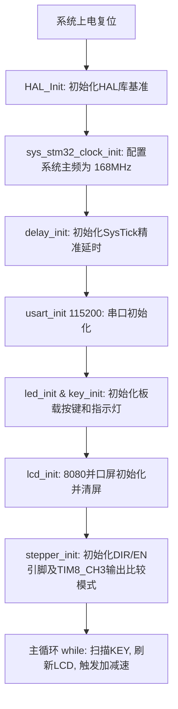
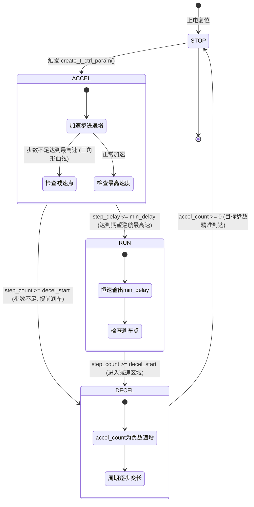

# 步进电机梯形加减速控制实验 —— 项目总结文档

## 一、项目概述

本项目是**正点原子（ALIENTEK）STM32F407 电机开发板**上的典型电机控制例程，项目名称为“**步进电机梯形加减速控制实验**”（`Exp8_7_StepperMotor_TrapezoidalAccelDecel`）。

步进电机由于转子具有机械转动惯量，若直接施加高频脉冲起步，电机会因来不及响应而产生**严重失步、堵转或振鸣**；若在高速巡航时瞬间切断脉冲，电机又会由于惯性产生**位置过冲**。为解决该问题，本项目基于经典的 **Atmel AVR446 应用笔记（David Austin 算法）**，在 STM32F407 平台上实现了一套高效、高精度的**梯形/三角形加减速运动规划控制系统**：

- **高效离散化递推算法**：采用一阶泰勒展开逼近，将传统开方物理公式转换为整数加减乘除，在定时器中断中以极低的 CPU 开销实时计算下一个脉冲周期；
- **自适应轨迹规划**：根据设定的目标步数、加速度、减速度和最高速度，自动判断生成**梯形曲线**（加速 $\to$ 匀速 $\to$ 减速）或**三角形曲线**（加速 $\to$ 减速）；
- **高级定时器输出比较（Toggle 模式）**：使用高级定时器 **TIM8_CH3** 的输出翻转模式产生脉冲，动态改变捕获/比较寄存器 CCR 的值来调整频率；
- **微步驱动支持**：支持 8 细分步进驱动，平稳无抖动；
- **人机交互与状态监控**：通过板载按键调整目标旋转圈数/角度并触发加减速，通过 8080 并口 LCD 和串口 1 实时显示设定角度与累计输出角度。

> 文档配套代码基于正点原子官方例程重构优化，版权归广州市星翼电子科技有限公司（正点原子）所有，本文档供工程维护与算法深入理解参考。

---

## 二、硬件平台与资源

### 2.1 主控与计算资源

| 项目 | 参数规格 |
| :--- | :--- |
| 主控 MCU | **STM32F407IGT6** |
| 内核架构 | ARM Cortex-M4（带单精度硬件 FPU、DSP 指令集） |
| 主频 | **168 MHz**（外部晶振 8 MHz，经 PLL 9 倍频） |
| 存储容量 | 1 MB Flash / 192 KB SRAM（128KB 系统 RAM + 64KB CCM-RAM） |
| 脉冲定时器时基 | 定时器计数时钟 $f_t = 168\text{ MHz} / 84 = 2\text{ MHz}$（时钟分辨率 $0.5\ \mu\text{s}$） |
| 编译工具链 | `arm-none-eabi-gcc`（CMake + Ninja） / Keil MDK-ARM |

### 2.2 驱动对象与板载外设

- **步进电机**：两相四线 42 步进电机（基本步距角 $1.8^\circ$，整步 200 步/圈）；
- **电机驱动接口**：板载 4 路步进电机驱动端口，本实验默认使用**步进电机接口 3（STEPPER_MOTOR_3）**；
- **驱动器细分**：硬件或模块设定为 **8 细分**，电机每转一整圈需 $200 \times 8 = 1600$ 个脉冲，步距角为 $1.8^\circ / 8 = 0.225^\circ$；
- **人机交互外设**：
  - **LED0（PE0）**：系统运行心跳指示灯，200ms 翻转一次；
  - **KEY0（PE2）**：启动加减速运动；
  - **KEY1（PE3）**：增加目标步数/角度（步进 1 圈）；
  - **KEY2（PE4）**：减少目标步数/角度（步进 1 圈）；
  - **LCD**：正点原子标准 16 位 8080 并口屏幕，显示设定角度与实时累加转角；
  - **USART1（PB6/PB7）**：115200 波特率，打印操作引导与调试信息。

---

## 三、硬件连接与引脚分配

本实验采用开发板上的**步进电机接口 3** 进行控制：

### 3.1 步进电机驱动信号引脚

| 引脚名称 | MCU 硬件引脚 | 复用功能 | 作用描述 |
| :--- | :--- | :--- | :--- |
| **PUL3（脉冲）** | **PI7** | `TIM8_CH3`（AF3） | 定时器输出比较翻转引脚，向驱动器输出 STEP 脉冲 |
| **DIR3（方向）** | **PB2** | 通用推挽输出（PP） | 电平控制电机旋转方向（高电平 CW / 低电平 CCW） |
| **EN3（使能/脱机）** | **PF11** | 通用推挽输出（PP） | 低电平使能驱动输出，高电平脱机释放电机转子 |

> **多通道映射说明**：工程已在底层封装支持 4 个电机的硬件宏，其中：
> - 接口 1: PUL=PI5(TIM8_CH1), DIR=PF14, EN=PF15
> - 接口 2: PUL=PI6(TIM8_CH2), DIR=PF12, EN=PF13
> - 接口 3: PUL=PI7(TIM8_CH3), DIR=PB2,  EN=PF11（**本实验使用**）
> - 接口 4: PUL=PC9(TIM8_CH4), DIR=PH2,  EN=PH3

### 3.2 其它外设接线表

| 外设 | MCU 引脚 | 模式 / 功能 |
| :--- | :--- | :--- |
| LED0（红） | PE0 | 推挽输出，低电平点亮 |
| KEY0 | PE2 | 下拉输入，高电平有效 |
| KEY1 | PE3 | 下拉输入，高电平有效 |
| KEY2 | PE4 | 下拉输入，高电平有效 |
| 串口 1 TX / RX | PB6 / PB7 | 复用为 `USART1_TX` / `USART1_RX` |
| LCD 数据与控制总线 | FSMC 对应引脚 | 16 位并行 8080 接口 |

> **关键接线注意事项**：
> 1. **JP2 跳线帽**：必须插好，默认接法为 `ST+ -- VCC5`, `ST- -- GND`，为驱动接口的光耦/驱动芯片供电；
> 2. **外部电源**：电机供电端需接入 DC 12V~36V 稳压电源。

---

## 四、软件架构与文件组织

```
Exp8_7_StepperMotor_TrapezoidalAccelDecel/
├── CMakeLists.txt                       # CMake 跨平台构建脚本
├── STM32F407IGTx_FLASH.ld               # GCC 链接脚本
├── readme.txt                           # 官方实验引脚接线说明
├── 项目总结文档.md                     # 本工程技术总结文档
├── User/
│   ├── main.c                           # 实验业务逻辑、按键交互与 LCD 显示
│   ├── stm32f4xx_it.c                   # 中断服务函数入口
│   ├── stm32f4xx_hal_conf.h             # HAL 库功能裁剪配置
│   └── printf_retarget.c                # GCC newlib _write 重定向
└── Drivers/
    ├── SYSTEM/
    │   ├── sys/                         # 系统时钟时基（168MHz 配置）
    │   ├── usart/                       # 串口 1 底层驱动
    │   └── delay/                       # 微秒/毫秒硬件级延时
    ├── BSP/
    │   ├── LED/                         # LED 初始化与反转控制
    │   ├── KEY/                         # 按键扫描（支持连按与去抖）
    │   ├── LCD/                         # 8080 并口屏幕驱动与字库
    │   ├── TIMER/                       # 定时器 TIM8 输出比较与 PWM 初始化
    │   │   ├── stepper_tim.h
    │   │   └── stepper_tim.c
    │   └── STEPPER_MOTOR/               # 梯形加减速核心算法与电机控制驱动
    │       ├── stepper_motor.h          # 物理模型参数宏与轨迹结构体
    │       └── stepper_motor.c          # 规划器 create_t_ctrl_param 与中断状态机
    └── STM32F4xx_HAL_Driver/            # ST 官方标准 HAL 库
```

---

## 五、系统启动与初始化流程

系统在 `main()` 函数中的执行流程如下：



1. **时钟配置**：外部 8MHz HSE $\to$ PLL 倍频至 **168MHz**（AHB=168MHz, APB1=42MHz, APB2=84MHz，定时器时钟倍频后 TIM8=168MHz）；
2. **定时器分频**：`stepper_init(0xFFFF, 84 - 1)`：
   - 自动重装载值 ARR 设为 `0xFFFF`（65535，作为 16 位定时器自由计数）；
   - 预分频系数 PSC 设为 $84 - 1$，定时器计数频率 $f_t = 168\text{ MHz} / 84 = 2\text{ MHz}$（时钟步长 $0.5\ \mu\text{s}$）。

---

## 六、梯形加减速核心算法深入剖析

本项目加减速之所以高效，是因为它成功摆脱了对浮点开方库函数 `sqrt()` 的实时依赖，转而在中断中使用纯整数算术运算。

### 6.1 物理建模与参数定义

设步进电机转过一步的角度为 $\alpha$（弧度）：
$$\alpha = \frac{2\pi}{\text{SPR}} = \frac{2\pi}{200 \times 8} \approx 0.003927\ \text{rad}$$

- 定时器时钟频率为 $f_t$（Hz）；
- 第 $n$ 步的脉冲周期时间为 $\delta t_n$，对应定时器比较值计数为 $c_n$（即 $c_n = \delta t_n \cdot f_t$）；
- 实际角速度 $\omega_n = \frac{\alpha}{\delta t_n} = \frac{\alpha \cdot f_t}{c_n}$。

### 6.2 初始脉冲周期 $c_0$ 的推导与校正

假设电机以恒定加速度 $a$（$\text{rad/s}^2$）启动，由初中物理位移公式 $\theta = \frac{1}{2} a t^2$ 可知：
第 1 步转过的角度为 $\alpha = \frac{1}{2} a (\delta t_0)^2$
$$\delta t_0 = \sqrt{\frac{2\alpha}{a}} \implies c_0 = f_t \cdot \sqrt{\frac{2\alpha}{a}}$$

**David Austin 修正系数**：
由于上述公式假设速度从 0 瞬时增加，理论推导表明计算出的 $c_0$ 偏大，会导致第一步加速度严重不足。经过高阶数值积分推导，第一步周期需乘上常数校正系数 **0.676**：
$$c_0 = 0.676 \cdot f_t \cdot \sqrt{\frac{2\alpha}{a}}$$

### 6.3 一阶泰勒逼近递推公式（核心提速秘诀）

两步之间的定时器计数值递推公式理论上为：
$$c_n = c_{n-1} \left( \sqrt{1 + \frac{1}{n}} - 1 \right) \approx c_{n-1} - \frac{2 c_{n-1}}{4n + 1}$$

- 公式中只剩下**减法、乘法和除法**；
- 引入余数变量 `rest` 保存每次整数除法截断被丢掉的小数部分：
  ```c
  new_step_delay = step_delay - (((2 * step_delay) + rest) / (4 * n + 1));
  rest = ((2 * step_delay) + rest) % (4 * n + 1);
  ```
  这彻底消除了长时间长距离离散化运行产生的累积位置误差与频率跳变。

### 6.4 轨迹判决与减速阶段的“数学黑魔法”

在规划函数 `create_t_ctrl_param` 中，先计算两个临界值：
1. **$n_{\text{max}}$（达到最高期望速度所需的步数）**：
   $$n_{\text{max}} = \frac{\omega_{\text{max}}^2}{2 \alpha \cdot a}$$
2. **$n_{\text{accel\_limit}}$（总步数约束下的最大加速步数）**：
   根据加减速物理对称性，若步数不足以达到最高速度，加速步与减速步满足：
   $$\frac{n_1}{n_2} = \frac{d}{a} \implies n_{\text{accel\_limit}} = \text{step} \times \frac{d}{a + d}$$

| 条件 | 曲线形态 | 轨迹特征 |
| :--- | :--- | :--- |
| $n_{\text{accel\_limit}} > n_{\text{max}}$ | **梯形曲线** | 加速至 $\omega_{\text{max}}$ $\to$ 保持恒定匀速巡航 $\to$ 减速刹停 |
| $n_{\text{accel\_limit}} \le n_{\text{max}}$ | **三角形曲线** | 尚未加速到最高速度即达到刹车点，直接平滑转入减速阶段 |

**为什么减速阶段的代码和加速阶段完全一样？**
- 在加速时，$n > 0$，分母 $4n + 1 > 0$，递推式做减法，周期越来越小（速度越来越快）；
- 在进入减速状态瞬间，算法将计数值 $n$（`accel_count`）赋为一个**负数**（即减速步数的相反数，例如 `-150`）；
- 每走一步 $n = n + 1$（向 0 逼近）。由于 $n < 0$，分母 $(4n + 1) < 0$！
- 此时：
  $$c_n = c_{n-1} - \frac{2 c_{n-1}}{\text{负数}} = c_{n-1} + \frac{2 c_{n-1}}{|4n + 1|}$$
- 负负得正，公式**自动变为加法，使脉冲周期逐渐变长（速度平稳降低）**！
- 当 $n \ge 0$ 时，减速步数恰好耗尽，电机精准刹停在目标点。

---

## 七、加减速状态机流转与执行流程



### 7.1 定时器输出比较中的 Toggle 模式细节

在中断函数 `HAL_TIM_OC_DelayElapsedCallback` 中：
```c
tim_count = __HAL_TIM_GET_COUNTER(&g_atimx_handle);
tmp = tim_count + g_srd.step_delay / 2;
__HAL_TIM_SET_COMPARE(&g_atimx_handle, ATIM_TIMX_PWM_CH3, tmp);

i++;
if(i == 2)
{
    i = 0;
    // ... 状态机处理 1 个完整步进脉冲 ...
}
```
**原因剖析**：
- STM32 定时器的 Toggle 模式是指：每当计数器值等于比较值 CCR 时，硬件引脚**自动翻转一次电平**；
- 1 个完整的步进脉冲包含**1 次上升沿 + 1 次下降沿**（电平翻转 2 次）；
- 因此半周期的延时比较值为 `step_delay / 2`，中断进 2 次才算走完了电机的一个微步。

---

## 八、实验操作与现象验证

### 8.1 操作步骤

1. 将 42 步进电机接入开发板 **步进电机接口 3**；
2. 确保跳线帽 **JP2** 连接正常（`ST+ -- VCC5`, `ST- -- GND`）；
3. 接入 12V~24V 直流电源至电机驱动供电端子，开启开发板电源；
4. 观察 LCD 屏幕显示：
   - 第一行显示：`Stepper Motor Test`；
   - 提示操作按键：`KEY0:Start`，`KEY1:Set++`，`KEY2:Set--`；
   - 状态行实时显示：`Set_Aangle: x`（设定转动圈数）与 `Add_Aangle: y.yy`（累计转过实际角度）；
5. 按下 **KEY1** 可增加目标旋转圈数，按下 **KEY2** 可减少目标旋转圈数；
6. 按下 **KEY0** 触发梯形加减速启动，电机会经历“平稳起步 $\to$ 高速巡航 $\to$ 平稳刹车”的完整加减速过程，最终精准停止在设定的目标角度上。

### 8.2 串口打印调试信息

打开串口调试助手（115200, 8-N-1），复位开发板后将打印：
```
KEY0：启动梯形加减速
KEY1：增加步数
KEY2：减少步数
```

---

## 九、工程常见问题与避坑指南

1. **电机只发抖不转动 / 剧烈堵转**：
   - 初始启动周期 $c_0$ 算出的初速度超过了电机的空载启动频率（即设定的 `accel` 过大）；
   - 驱动器细分开关拨码与程序中 `MICRO_STEP` 宏不匹配（若驱动器实际为 16 细分而代码按 8 细分计算，速度会减半，步数翻倍）；
   - 驱动器电机相线接错（如 A+、A- 与 B+、B- 串相），请使用万用表测量电机同相绕组确保对应连接。
2. **高速段失步**：
   - `speed` 设置过高导致 `min_delay` 小于定时器处理极限或电机转矩截止频率；
   - 驱动电压不足（如仅用 5V 供电驱动 42 电机，高速反电动势会导致电流下降而失步，推荐使用 12V~24V 供电）。
3. **定位终点角度有微小漂移**：
   - 检查 `rest` 余数累加机制是否正常工作；
   - 确认中断优先级：TIM8 输出比较中断（`TIM8_CC_IRQn`）应配置较高的抢占优先级，防止被高频的 SysTick 或其它中断长时间打断造成翻转时延跳跃。
